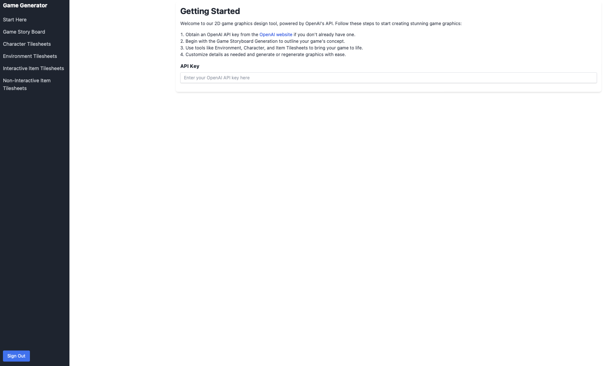
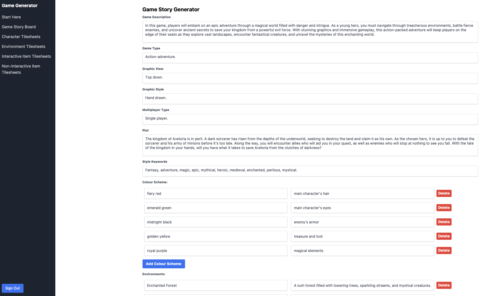
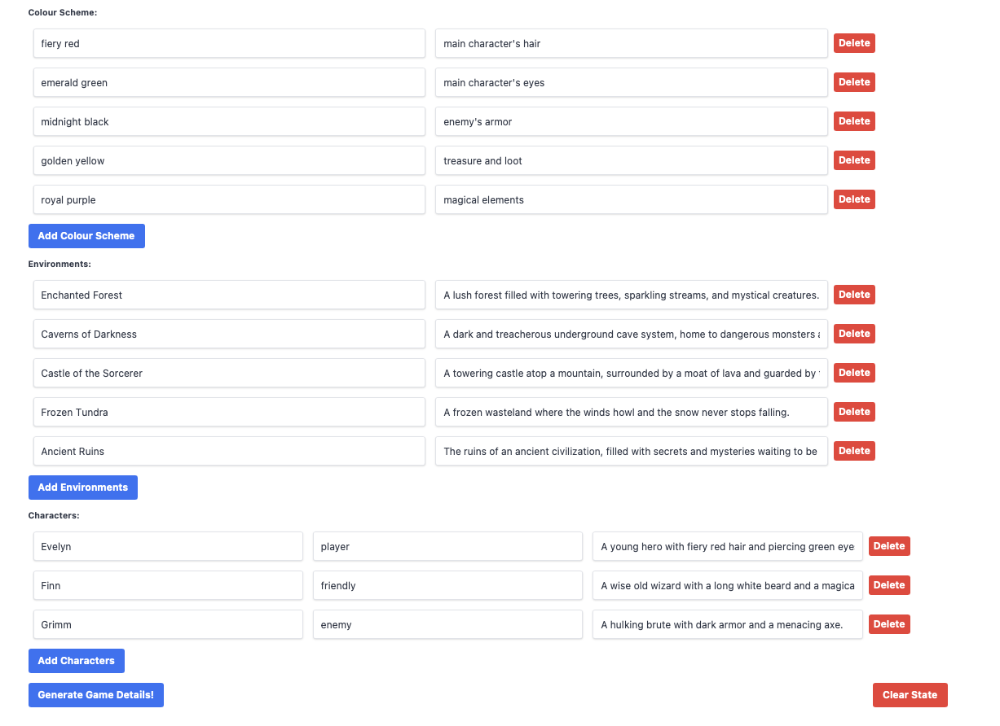
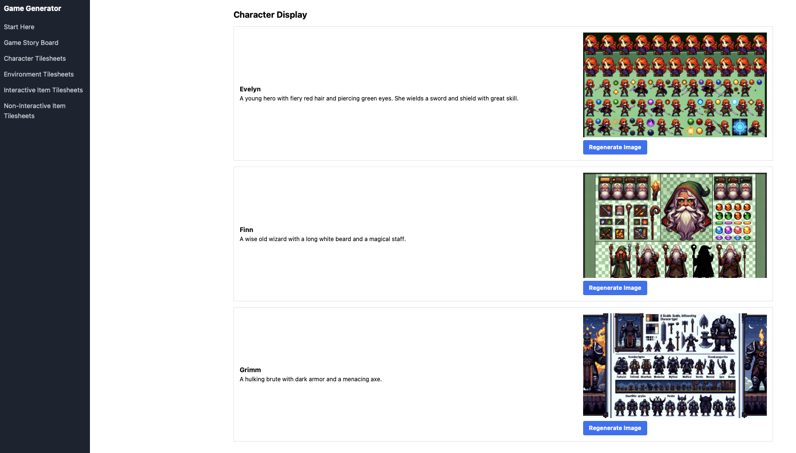
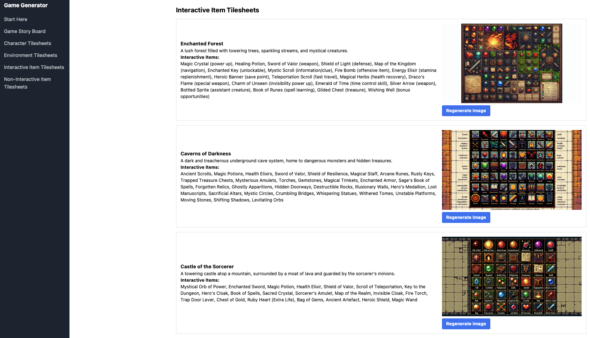
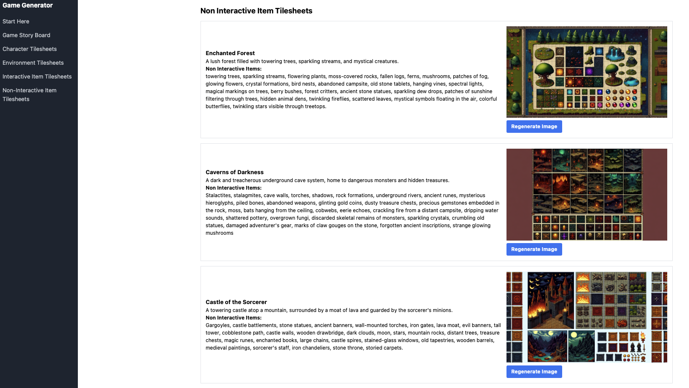
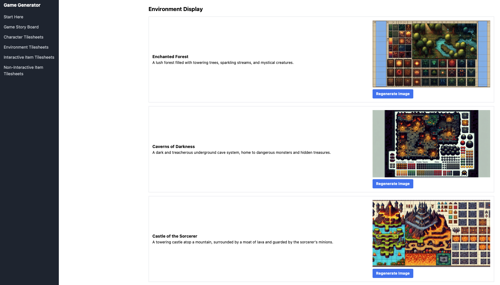

# Full Stack Game Artwork Generator

Please have a go at using this tool and let me know what you think, feel free to leave any issues or suggestions in the issues tab.

It is currently deployed here: https://d2g616vd3ybkz1.cloudfront.net

You will have to create a login to use the tool so that my API is protected from some abuse!

NOTE: The login button is currently not visible, but it is there!

## What does it do?

On the app landing page users are prompted to enter their OpenAI API key which is used to authenticate requests with OpenAI in the backend:
This is what it looks lik:

On the Game Story Generator the app prompts users for input, where users can specify the type of game they are generating graphics for along with other game attributes. When they have entered as much information as they like, the remaining information can be generated by the AI. This is what it looks like: 

There are then various pages where users can generate game style artwork:

### Characters

### Interactive Items

### Non Interactive Items

### Environment Tiles

## Stack

Features:

- Landing site (about/app pages)
- Login Page (AWS Amplify) 
- Web App hidden behind login
- Ability to enter your own OpenAI API key

This is a web-app built using React/Typescript for the frontend and python & AWS Serverless for the backend. All the required infrastructure is in code and the full stack can be deployed using the deploy.sh script here.

The backend functionality is a series of prompts fed into DALL-E and gpt 3.5 and 4 from openAI, with the api hosted on AWS Lambda.

Architecture Components:

- AWS Lambda & API Gateway
- AWS Cloudfront
- AWS Cognito & Amplify

